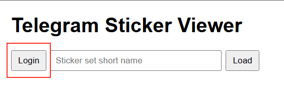
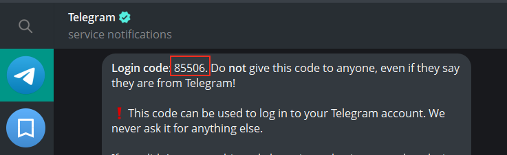
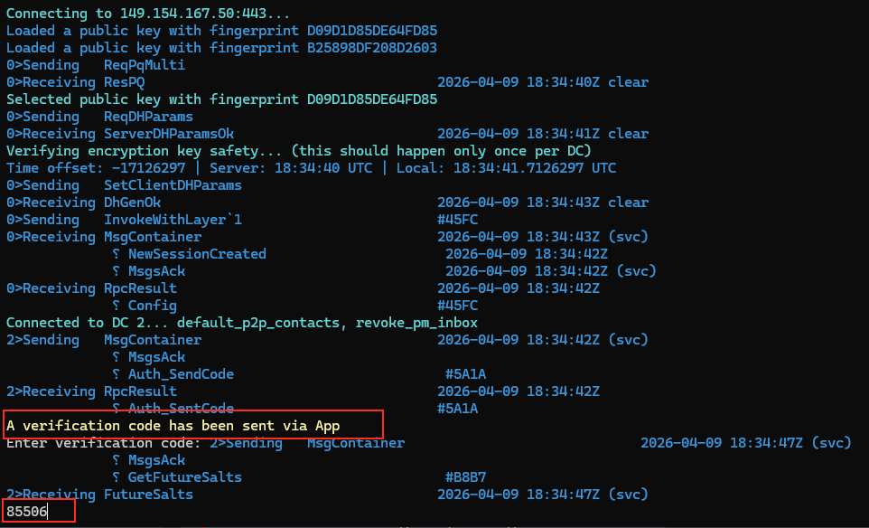
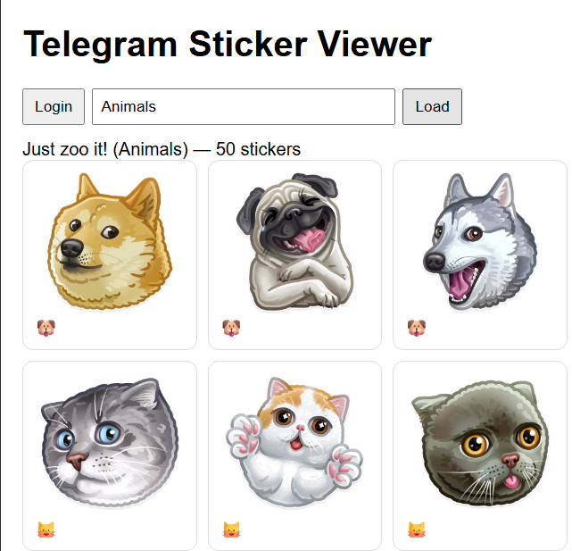

# Telegram Sticker Viewer

Small ASP.NET Core tool for loading a Telegram sticker pack by its short name and viewing the stickers in a browser.

## Configuration

Edit `appsettings.json` and fill in:

- `Telegram:ApiId`
- `Telegram:ApiHash`
- `Telegram:PhoneNumber`
- `Telegram:SessionPath`

You can get `ApiId` and `ApiHash` from [my.telegram.org](https://my.telegram.org).

The session file is created after the first successful Telegram login and lets the app reuse the saved authorization later.

## First Run

Run the web app from the repository root:

```bash
dotnet run --project .\src\TelegramStickerViewer\TelegramStickerViewer.csproj
```

Open the local site shown by ASP.NET Core in the terminal, then:

1. Click `Login`.



2. Complete the interactive Telegram login flow in the terminal where the app is running.

Receive the Telegram login code:



Paste it into the application console and press Enter:



3. After successful login, the session will be saved to the configured `SessionPath`.

If the session file already exists, the app should reuse it and normally will not ask you to log in again.

## Usage

After login:

1. Enter a sticker pack short name, for example `Animals`.
2. Click `Load`.
3. The app requests the sticker set from Telegram and shows the stickers on the page.



## Notes

- Static stickers are served as `.webp`.
- Video stickers are served as `.webm`.
- Animated `.tgs` stickers are currently detected, but not rendered in the browser UI.
